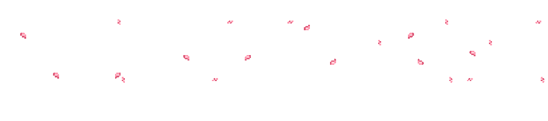

 

<!-- Greeting -->
<h1 align="center">
  
</h1>

<h6 align="left">
🌟 Sou estudante de Análise e Desenvolvimento de Sistemas na Faculdade Impacta, formada no curso de Programação do Instituto PROA e Técnica em Desenvolvimento de Sistemas pela Etec SEBRAE. Gosto do desenvolvimento back-end, buscando criar soluções eficientes e escaláveis. Estou sempre aprendendo e explorando novas tecnologias para crescer profissionalmente.
</h6>

<!-- About me -->
<h3 align="left">💫 Sobre Mim</h3>
<h6>
🌱 Atualmente estou aprimorando minhas habilidades em programação. 
🔭 Tenho experiência com arquitetura MVC e já trabalhei com Flask. 
💬 Estou sempre desenvolvendo competências em diversas áreas do desenvolvimento. 
⚡ Tenho grande interesse por Inteligência Artificial, especialmente Machine Learning e automação. 
🐱 Sou apaixonada por gatos!!. 
🎸 Gosto de bandas emo e hard rock — a música é essencial no meu dia a dia! 
✨ Sou detalhista e gosto de entregar o melhor em tudo o que faço.
</h6>

<!-- Contatos -->
<h3>🧲 Contato</h3>

---

<!-- Github status -->
<h3 align="center">🌱 Github Status</h3>

  
  

---

<!-- Linguagens -->
<h3 align="center">📚 Tecnologias que já utilizei</h3>

   
   
   

<!-- Stack -->
<h3 align="center">💻 Tech Stack</h3>

  
  
  
  
  

---

<!-- Footer GIF -->

<!-- Linha decorativa -->

